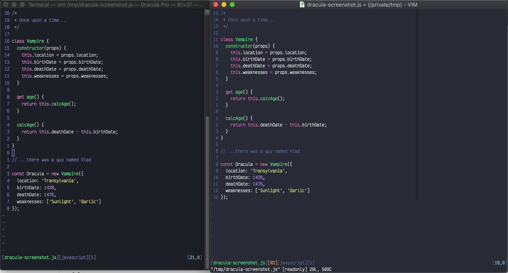

# Dracula for [Vim](http://www.vim.org/)

> A dark theme for [Vim](http://www.vim.org/).

Screenshot taken with the [pangloss/vim-javascript](https://github.com/pangloss/vim-javascript)
syntax plugin for javascript.

## Install

All instructions can be found at [draculatheme.com/vim](https://draculatheme.com/vim).

## Team

This theme is maintained by the following person(s) and a bunch of
[awesome contributors](https://github.com/dracula/vim/graphs/contributors).

|  |  |
| ----------------------------------------------------------------------------------------------------- | ----------------------------------------------------------------------------------------------------------- |
| [Derek S.](https://github.com/dsifford)                                                               | [David Knoble](https://github.com/benknoble)                                                                |

## Community

- [Twitter](https://twitter.com/draculatheme) - Best for getting updates about themes and new stuff.
- [GitHub](https://github.com/dracula/dracula-theme/discussions) - Best for asking questions and discussing issues.
- [Discord](https://draculatheme.com/discord-invite) - Best for hanging out with the community.

## License

[MIT License](./LICENSE)
