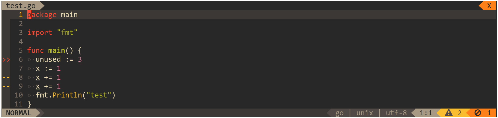

# lightline-ale

This plugin provides [ALE](https://github.com/w0rp/ale) indicator for the [lightline](https://github.com/itchyny/lightline.vim) vim plugin.



## Table Of Contents

* [Installation](#installation)
* [Integration](#integration)
* [Configuration](#configuration)
* [License](#license)

## Installation

Install using a plugin manager of your choice, for example:

```viml
call dein#add('w0rp/ale')                 " Dependency: linter
call dein#add('itchyny/lightline.vim')    " Dependency: status line
call dein#add('maximbaz/lightline-ale')
```

## Integration

1. Register the components:

```viml
let g:lightline = {}

let g:lightline.component_expand = {
      \  'linter_checking': 'lightline#ale#checking',
      \  'linter_infos': 'lightline#ale#infos',
      \  'linter_warnings': 'lightline#ale#warnings',
      \  'linter_errors': 'lightline#ale#errors',
      \  'linter_ok': 'lightline#ale#ok',
      \ }
```

2. Set color to the components:

```viml
let g:lightline.component_type = {
      \     'linter_checking': 'right',
      \     'linter_infos': 'right',
      \     'linter_warnings': 'warning',
      \     'linter_errors': 'error',
      \     'linter_ok': 'right',
      \ }
```

3. Add the components to the lightline, for example to the right side:

```viml
let g:lightline.active = { 'right': [[ 'linter_checking', 'linter_errors', 'linter_warnings', 'linter_infos', 'linter_ok' ]] }
```

## Configuration

##### `g:lightline#ale#indicator_checking`

The indicator to use when ALE is in progress. Default is `Linting...`.

##### `g:lightline#ale#indicator_infos`

The indicator to use when there are infos. Default is `I:`.

##### `g:lightline#ale#indicator_warnings`

The indicator to use when there are warnings. Default is `W:`.

##### `g:lightline#ale#indicator_errors`

The indicator to use when there are errors. Default is `E:`.

##### `g:lightline#ale#indicator_ok`

The indicator to use when there are no warnings or errors. Default is `OK`.

### Using icons as indicators

If you would like to replace the default indicators with symbols like on the screenshot, then you'll need to ensure you have some "iconic fonts" installed, such as [Font Awesome](https://fontawesome.com). A common alternative is to replace your primary font with one of the [Patched Nerd Fonts](https://github.com/ryanoasis/nerd-fonts), which saves you from having to install multiple fonts.

The following icons from the Font Awesome font are used in the screenshot:

* Checking: [f110](https://fontawesome.com/icons/spinner)
* Infos: [f129](https://fontawesome.com/icons/info)
* Warnings: [f071](https://fontawesome.com/icons/exclamation-triangle)
* Errors: [f05e](https://fontawesome.com/icons/ban)
* OK: [f00c](https://fontawesome.com/icons/check) (although I prefer to disable this component)

To specify icons in the configuration, use their unicode codes as `"\uXXXX"` (make sure to wrap them in double quotes). Alternatively copy the icons from a font website, or type <kbd>\<C-v\>u\<4-digit-unicode\></kbd> or <kbd>\<C-v\>U\<8-digit-unicode\></kbd> to insert the literal characters.

See the code points here:

* Font Awesome: https://fontawesome.com/icons
* Nerd Fonts: https://github.com/ryanoasis/nerd-fonts#glyph-sets

Here's the configuration snippet used in the screenshot:

```viml
let g:lightline#ale#indicator_checking = "\uf110"
let g:lightline#ale#indicator_infos = "\uf129"
let g:lightline#ale#indicator_warnings = "\uf071"
let g:lightline#ale#indicator_errors = "\uf05e"
let g:lightline#ale#indicator_ok = "\uf00c"
```

## License

Released under the [MIT License](LICENSE)
