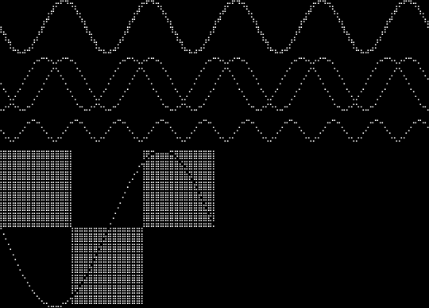
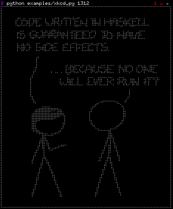
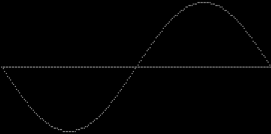
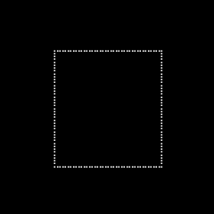
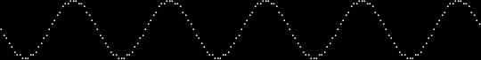
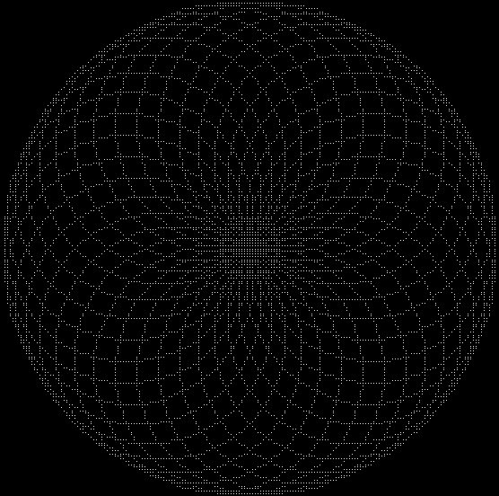

DRAWILLE
========


Drawing in terminal with Unicode [Braille][] characters

[Braille]: http://en.wikipedia.org/wiki/Braille

[](https://flattr.com/submit/auto?user_id=asciimoo&url=https://github.com/asciimoo/drawille&title=drawille&language=&tags=github&category=software)










### USAGE

```python
from __future__ import print_function
from drawille import Canvas
from math import sin, radians

c = Canvas()

for x in range(0, 1800, 10):
    c.set(x / 10, 10 + sin(radians(x)) * 10)

print(c.frame())
```



```python
from drawille import Turtle

t = Turtle()

for _ in range(36):
    t.right(10)
    for _ in range(36):
        t.right(10)
        t.forward(8)

print(t.frame())
```




### Installation

To install drawille, simply:

```bash
$ pip install drawille
```

or

```bash
$ easy_install drawille
```


### Bugs

Bugs or suggestions? Visit the [issue tracker](https://github.com/asciimoo/drawille/issues).


Tested fonts

| Font  | Works |
| ----- | ----- |
| Fixed | Yes   |


Tested terminals

| Terminal     | Works |
| ------------ | ----- |
| rxvt-unicode | Yes   |


### LICENSE

```
drawille is free software: you can redistribute it and/or modify
it under the terms of the GNU Affero General Public License as published by
the Free Software Foundation, either version 3 of the License, or
(at your option) any later version.

drawille is distributed in the hope that it will be useful,
but WITHOUT ANY WARRANTY; without even the implied warranty of
MERCHANTABILITY or FITNESS FOR A PARTICULAR PURPOSE.  See the
GNU Affero General Public License for more details.

You should have received a copy of the GNU Affero General Public License
along with drawille. If not, see < http://www.gnu.org/licenses/ >.

(C) 2014- by Adam Tauber, <asciimoo@gmail.com>
```


### Other implementations / similar projects

 * [https://github.com/madbence/node-drawille](https://github.com/madbence/node-drawille) (nodejs)
 * [https://github.com/exrook/drawille-go](https://github.com/exrook/drawille-go) (go)
 * [https://github.com/maerch/ruby-drawille](https://github.com/maerch/ruby-drawille) (ruby)
 * [https://github.com/sunetos/TextPlots.jl](https://github.com/sunetos/TextPlots.jl) (julia)
 * [https://github.com/mkremins/drawille-clj](https://github.com/mkremins/drawille-clj) (clojure)
 * [https://github.com/mydzor/bash-drawille](https://github.com/mydzor/bash-drawille) (bash)
 * [https://github.com/hoelzro/term-drawille](https://github.com/hoelzro/term-drawille) (perl 5)
 * [https://github.com/whatthejeff/php-drawille](https://github.com/whatthejeff/php-drawille) (PHP)
 * [https://github.com/yamadapc/haskell-drawille](https://github.com/yamadapc/haskell-drawille) (haskell)
 * [https://github.com/P1start/drawille-rs](https://github.com/P1start/drawille-rs) (rust)
 * [https://github.com/liam-middlebrook/drawille-sharp](https://github.com/liam-middlebrook/drawille-sharp) (C#)
 * [https://github.com/asciimoo/lua-drawille](https://github.com/asciimoo/lua-drawille) (Lua)


### Further reading

 * [HackerNews](https://news.ycombinator.com/item?id=7776112)
 * [Reddit](http://www.reddit.com/r/programming/comments/263opn/drawille_pixel_graphics_in_a_terminal_using/)
 * [ohloh](http://www.ohloh.net/p/drawille)
 * [xkcd comics in Braille using drawille](http://blog.yjl.im/2014/04/xkcd-comics-in-braille-using-drawille.html)
 * [Braille unicode pixelation](http://blog.jverkamp.com/2014/05/30/braille-unicode-pixelation/)
